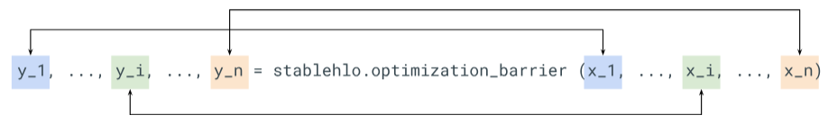
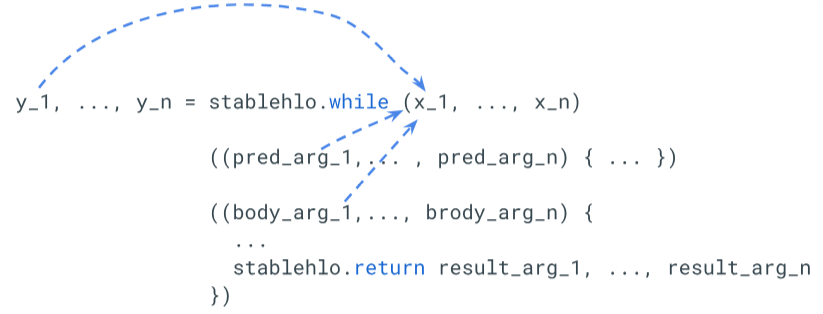
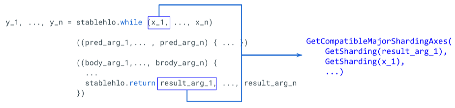
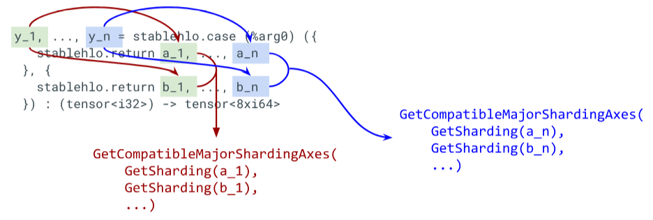

# Data flow edge ops

See [sdy.data_flow_edge](./sdy_dialect.md#sdy.data_flow_edge) for more information.

The above propagation step description applies to every op other than `CustomCallOp`, `OptimizationBarrierOp`, `WhileOp`, and `CaseOp`. These operations use data-flow edges, which define a bridge between a set of sources and a set of targets of this op, such that all sources and targets should be sharded in the same way.

#### OptimizationBarrierOp

[See StableHLO for the spec of the op](https://github.com/openxla/stablehlo/blob/main/docs/spec.md#optimization_barrier). This op can be thought of as being 1:1 identity mappings between the operand and result, with there being no relationship between how any two operand-result pairs `i` and `j` are sharded.

##### Why an Operation sharding rule doesn’t work

You may think that since this op has no region, then why aren’t we creating a sharding rule? Well, let's try! For this you may think the registry would have something like this:

```
([arg_0_i, arg_0_j,...],..., [arg_n_i, arg_n_j,...])->([result_0_i, result_0_j,...],..., [result_n_i, result_n_j,...])
```

So each dimension has a unique factor corresponding to its result. But doing so, if we partition the op on some axis, then that axis would correspond to an argument’s dimension’s factor. But since that factor doesn’t appear in any of the other operands/results, **we would mark the rest of the operands/results as replicated on that axis**! But that isn’t what we want here. We want to allow the other operands/results to also be partitioned on this axis.

What’s important to realize is that `OptimizationBarrierOp` is not a typical op. There is no relationship between `arg_i`/`result_i` and `arg_j`/`result_j`. Each operand/result pairs are independent of one another.

##### Solution

A data flow edge of some op X defines a bridge between a set of *sources* and a set of *targets*, such that all sources and targets should be sharded in the same way.

For example, given the `custom_op` defined below:

```c
  y_1, ..., y_n = custom_op (x_1, ..., x_n)
                  ((body_arg_1,..., body_arg_n) {
                    ...
                    return return_value_1, ..., return_value_n
                  })
```

This `custom_op` has two types for data flow edges: `n` edges each between `return_value_i` (sources) and `y_i` (targets) and `n` edges between `x_i` (sources) and `body_arg_i` (targets).

When looking up the sharding of an operand of some operation `op`, the partitioner will "flow through" the operation. In this case, the sharding of the sources will be determined by the targets. In general, the shardings will be propagated between the sources and targets of each data flow edge, similar to the way shardings are propagated between the operands and results of non-data-flow operations.



```c
GetSharding(y_i); // Sharding of x_i
```

#### WhileOp

The same sort of logic from `OptimizationBarrierOp` is used on `WhileOp`. However, this time there is some added complexity due to it being a region op with multiple "operands" per result value. An op can have multiple data flow edges that are orthogonal to one another.

```c
 y_1, ..., y_n = stablehlo.while (x_1, ..., x_n)
                 ((pred_arg_1,... , pred_arg_n) { ... })
                 ((body_arg_1,..., body_arg_n) {
                   ...
                   stablehlo.return result_arg_1, ..., result_arg_n
                 })
...
 _ = op(..., y_i, ...)
```

This while op has `n` data flow edges, the `i`-th data flow edge is between sources `x_i`, `return_value_i` and targets `y_i`, `pred_arg_i`, `body_arg_i`. As before, the sharding of the sources is determined by the targets.

```c
GetSharding(y_i);          // Sharding of x_i
GetSharding(body_arg_i);   // Sharding of x_i
GetSharding(pred_arg_i);   // Sharding of x_i
```



`pred_arg_i` and `body_arg_i` can never have shardings on them (restriction of MLIR not allowing attributes to be added on op block arguments), so we alias the sharding that `x_i` has. However, the same can’t be said for what we do for `result_arg_i`.

Since we partition inside of the `WhileOp` body, we need to consider the shardings inside the region as well. So what do we do when we want to propagate the sharding of `result_arg_i` backwards, up to the defining op of `x_i`? Or propagate the sharding of `x_i` to the corresponding `result_arg_i`? What we need to do is find the most compatible sharding between it and its corresponding `x_i`, and update whichever needs updating using the compatible sharding (most compatible since both may have different shardings).



#### CaseOp

Similar logic is used for `CaseOp` as for `WhileOp` except:

* Since a `CaseOp` body is just a return, there is no propagation happening inside the body. We just look up the sharding of each corresponding branch value.
* But since each branch may have different shardings, values `a_i`/`b_i` below, then there may be a conflict. We need to resolve this in a similar way to how we propagate to `result_arg_i` in `WhileOp`.


