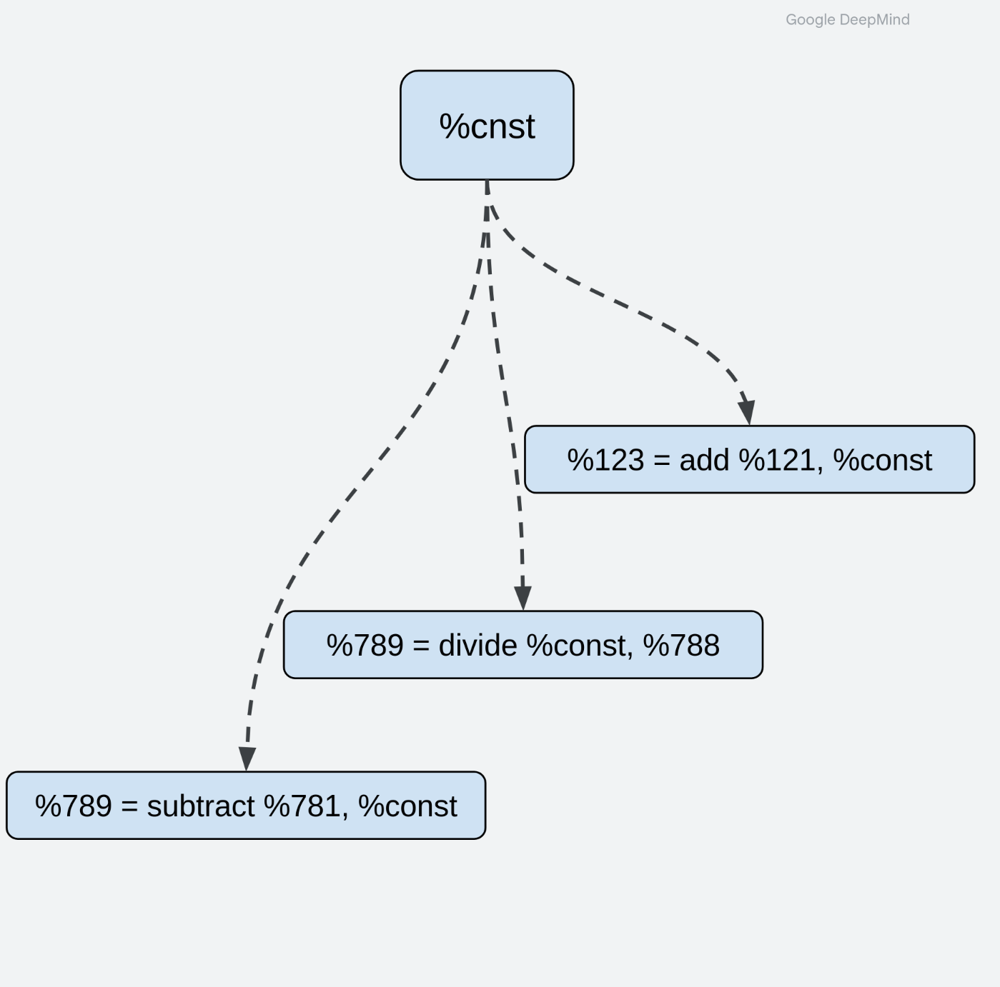
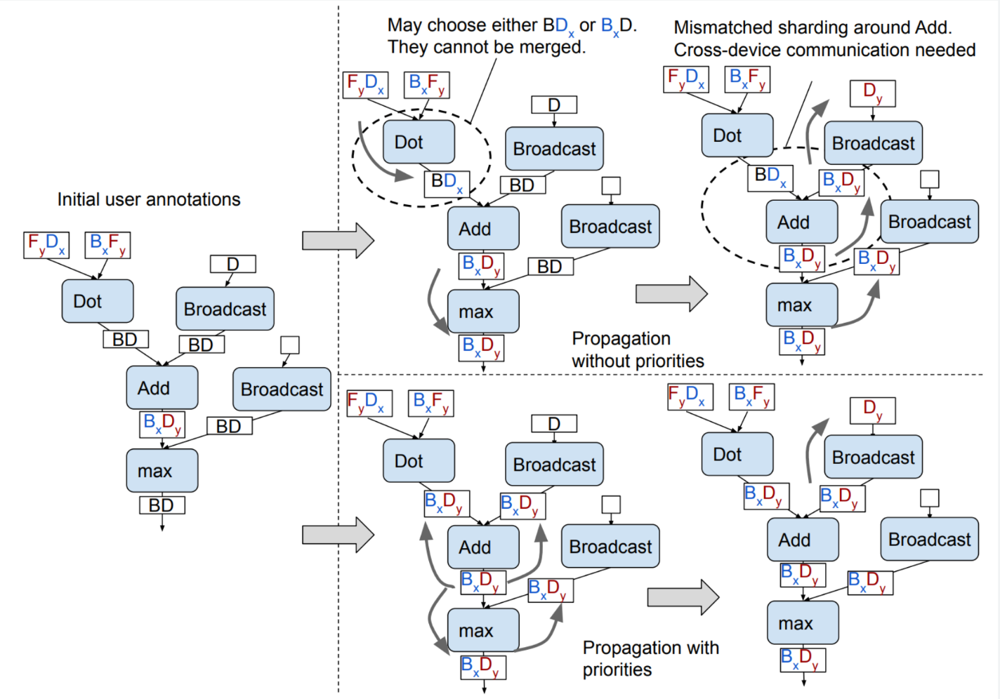

# Dialect-agnostic Sharding

Our long term goal with Shardy is to make it a completely standalone component, able to work with any MLIR dialect.
At the moment, we directly depend on StableHLO, but we are making progress towards lifting that through various
abstractions and interfaces to make Shardy more flexible.

Shardy will provide a variety of interfaces and traits. Dialect owners can easily integrate these into their own ops.

## Sharding Rules

A _Sharding rule_ encodes how we can propagate through an operation. Since Shardy now depends on StableHLO, it defines
sharding rules for each op. In the future, the goal is to have users of Shardy implement this interface in their
operations to define their own sharding rules.

As long as an operation implements this interface, Shardy will be able to propagate through it.

```c++
def ShardingRuleOpInterface : OpInterface<"ShardingRuleOpInterface"> {
  let methods = [
    InterfaceMethod<
      /*desc=*/[{
        Returns the sharding rule of the op.
      }],
      /*retType=*/"mlir::sdy::OpShardingRuleAttr",
      /*methodName=*/"getShardingRule"
    >,
  ];
}
```

## Region-based ops

Region ops are more complicated in that we need to make sure we can propagate into and out of them. Our sharding rules
aren't enough for this since they only describe the correspondence between operands and results, but region ops don't
have such a relationship.

Used for: while loops, case, optimization barriers, region based ops, etc.

So we've defined a `ShardableDataFlowOpInterface` where you define various methods to tell us
what Value on the operand plus `block_arg` barrier and region terminator plus op result barrier owns the shardings.

<!-- I’ll skip the details of this for offline discussions of the various methods and how they are used, but overall the
point is we have a way to handle any arbitrary region based op. We can even make this work for CallOps and propagating
into their callee, as long as the function is unique per caller. -->


<!-- Related to data-flow edge ops? -->

```c++
def ShardableDataFlowOpInterface :
    OpInterface<"ShardableDataFlowOpInterface"> {
  (get|set)BlockArgumentEdgeOwnerShardings;
  (get|set)OpResultEdgeOwnerShardings;
  getBlockArgumentEdgeOwners;
  getOpResultEdgeOwners;
  getEdgeSources;
  // ...
}

%0:2 = stablehlo.while(%iterArg = %arg0, %iterArg_2 = %c) 
  : tensor<32x96xf32>, tensor<i32>
  cond {
  // ...
  stablehlo.return %3 : tensor<i1>
} do {
  // ...
  stablehlo.return %4, %3 : tensor<32x96xf32>, tensor<i32>
}
```

## Constant splitting

Most tensor programs in MLIR that we see have one instance of a constant that is reused by whatever op that needs that
value. This makes sense when the constant needed is the same. However, when sharding a program, we want each use to have
the constant it specifically needs, and not be affected by how other ops use that constant.

We want to allow each use of a constant to have a differently sharded constant if they request one. Just because 2 parts
of a program are using some constant value, shouldn't mean they are sharded the same!

For example in the figure below, if the add is sharded, why should the divide and subtract in different parts of the
computation also be sharded the same way as that constant? It doesn't really make sense.



We call this a _false dependency_ since constants are cheap and there isn't a real dependency of ops that use the same
constant. As such we ask users to tell us what is there constant op, and also what ops are constant-like such as iota,
and what ops are foldable.

Want unique constants per use for optimal sharding
Don't want shardings to propagate through a constant due to multiple uses (false dependency)
Each use can have a different sharding that can propagate in isolation to its own copy of the constant sub-computation.
Shardy users need to define:
- `your_dialect.constant` -> `sdy.constant` pass
- `sdy::ConstantLike` trait, such as iota ops
- `mlir::Elementwise` trait for element-wise ops like add and multiply
- `sdy::ConstantFoldable` for ops like slice/broadcast. These ops can technically be calculated at compile time, if all
  their operands/results are constants.

## Op priorities

To recall GSPMD has the style of op based propagation where they propagate element-wise ops first then ops like matmul.
This needs to be configurable by end users since we don't know about their dialects. As such we just need the user to
specify them for us, so we will ask them to pass a list of ops in the order they want Shardy to propagate them in.

- GSPMD (and Shardy) defines a pre-registered order of what ops get propagated around first
  - Element-wise -> broadcasts -> matmuls -> ...
- Currently hard coded in Shardy on StableHLO ops
- Plan: tell us in what order (and direction*) to propagate ops

* Direction of propagation is sometimes important as well, see the GSPMD paper!



## Being dialect-agnostic

As long as you implement the previous interfaces, traits, and pass, Shardy will be able to work for your dialect!

And that's everything needed to make Shardy propagation work. More work will be needed for the spmd-ifiction or partitioning pass, but that is our focus next year

