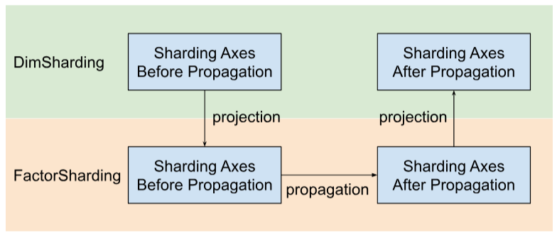
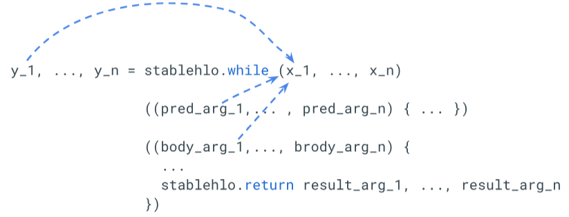
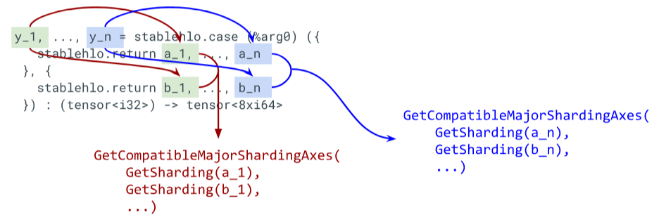

# Propagation

## Overview

Sharding propagation uses the user-specified shardings to infer the unspecified shardings of tensors (or specific dimension of tensors). It traverses the data flow (use-def chains) of the computation graph in both directions until a fixed point is reached, i.e., the sharding can no longer change without undoing previous sharding decisions.

Propagation can be decomposed into steps. Each step involves looking at a specific operation and propagating between tensors (operands and results), based on the characteristics of that operation. Taking a matmul as an example, we would propagate between the non-contracting dimension of either lhs or rhs to the corresponding dimension of the result, or between the contracting dimension of the lhs and rhs.

The characteristics of an operation determine the connection between corresponding dimensions in its inputs and outputs, and can be abstracted as a per op [sharding rule](#operation-sharding-rule).

Without conflict resolution, a propagation step would simply propagate as much as it can while ignoring the conflicting axes; we refer to this as the (longest) compatible major sharding axes.

## Detailed Design

### Conflict resolution hierarchy

We compose multiple conflict resolution strategies in a hierarchy:

1. **User defined priorities**. In [Sharding Representation](sharding_representation.md), we described how priorities can be attached to dimension shardings to allow for incremental partitioning of the program, e.g., doing batch parallelism -> megatron -> ZeRO sharding. This is achieved by applying propagation in iterations - at iteration `i` we propagate all dimension shardings that have priority `<=i` and ignore all others. We also make sure that propagation won’t override user defined shardings with lower priority (`>i`), even if they are ignored during previous iterations.
2. **Operation based priorities**. We propagate shardings, based on the operation type. The “pass-through” operations (e.g., element-wise operations and reshape) have the highest priority, while operations with shape transformation (e.g., dot and reduce) have lower priority.
3. **Aggressive propagation.** Propagate shardings with an aggressive strategy. The basic strategy only propagates shardings without conflicts, while the aggressive strategy resolves conflicts. Higher aggressiveness can reduce the memory footprint at the cost of potential communication.
4. **Basic Propagation.** It is the lowest strategy of propagation in the hierarchy, that doesn't do any conflict resolution, and instead propagates axes that are compatible between all operands and results.


This hierarchy can be interpreted as nested for loops. For example, for each user priority, a full op-priority propagation is applied.

### Operation sharding rule

The sharding rule introduces an abstraction of every operation that provides the actual propagation algorithm with the information it needs to propagate shardings from operands to results or across operands, etc., without having to reason about specific operation types and their attributes. This is essentially factoring out the op-specific logic and providing a shared representation (data structure) for all ops for the purpose of propagation only. In its simplest form, it just provides this function:

```c
GetOpShardingRule(Operation *) -> OpShardingRuleAttr
```

The rule allows us to write the propagation algorithm only once in a generic way that is based on this data structure (OpShardingRule), instead of replicating similar pieces of code across many ops, vastly reducing the possibility for bugs or inconsistent behavior across ops.

Let's go back to the matmul example.

An encoding that encapsulates the information needed during propagation, i.e., the relations between dimensions, can be written in the form of einsum notation:

```
(i, k), (k, j) -> (i, j)
```

In this encoding, every dimension is mapped to a single factor.

**How propagation uses this mapping:** If a dimension of an operand/result is sharded along an axis, propagation will lookup the factor of that dimension in this mapping, and shard other operands/results along their respective dimension with the same factor – and (subject to the earlier discussion about replication) potentially also replicate other operands/results that don’t have that factor along that axis.

### Compound factors: extending the rule for reshapes

In many ops, e.g., matmul, we only need to map each dimension to a single factor. However, it is not enough for reshapes.

The following reshape merges two dimensions into one:

```
%out = mhlo.reshape(%in) : (tensor<2x4x32xf32>) -> tensor<8x32xf32>
```

Here both dimensions 0 and 1 of the input correspond to dimension 0 of the output. Say we start by giving factors to the input:

```
(i,j,k) : i=2, j=4, k=32
```

You can see that if we want to use the same factors for the output, we would need a single dimension to reference multiple factors:

```
(i,j,k) -> ((ij), k) : i=2, j=4, k=32
```

The same can be done if the reshape were to split a dimension:

```
%out = mhlo.reshape(%in) : (tensor<8x32xf32>) -> tensor<2x4x32xf32> ((ij), k) -> (i,j,k) : i=2, j=4, k=32
```

The dimension of size 8 here is essentially composed of the factors 2 and 4, which is why we are calling the factors (i,j,k) factors.

These factors can also work with cases where there is no full dimension that corresponds to one of the factors:

```
%out = mhlo.reshape(%in) : (tensor<8x4xf32>) -> tensor<2x16xf32> ((ij), k) -> (i,(jk)) : i=2, j=4, k=4
```

This example also emphasizes why we need to store the factor sizes - since we can't easily deduce them from the corresponding dimensions.

### Core Propagation Algorithm

#### Propagate shardings along factors

In Shardy, we have the hierarchy of tensors, dimensions, and factors. They represent data at different levels. A factor is a sub-dimension. It is an internal hierarchy used in sharding propagation. Each dimension may correspond to one or more factors. The mapping between dimension and factor is defined by OpShardingRule.


**Shardy propagates sharding axes along factors instead of dimensions**. To do that, we have three steps as shown in the figure below

1. Project DimSharding to FactorSharding
2. Propagate sharding axes in the space of FactorSharding
3. Project the updated FactorSharding to get the updated DimSharding



#### Visualization of Sharding Propagation Along Factors

We will use the following table to visualize the sharding propagation problem and algorithm.

|  | F0 | F1 | F2 | Explicitly replicated axes |
| :---- | :---- | :---- | :---- | :---- |
| T0 |  |  |  |  |
| T1 |  |  |  |  |
| T2 |  |  |  |  |

* Each column represents a factor. F0 means the factor with index 0. We propagate shardings along factors (columns).
* Each row represents a tensor. T0 refers to the tensor with index 0. Tensors are all operands and results involved for a specific operation. The axes in a row cannot overlap. An axis (or sub-axis) cannot be used to partition one tensor many times. If an axis is explicitly replicated, we cannot use it to partition the tensor.

Thus, each cell represents a factor sharding. A factor can be missing in partial tensors. The table for `C = dot(A, B)` is below. The highlighted cells imply that the factor is not in the tensor. For example, F2 is in T1 and T2, but not in T0.

| `C = dot(A, B)` | F0 Batching dim | F1 Non-contracting dim | F2 Non-contracting dim | F3 Contracting dim | Explicitly replicated axes |
| :---- | :---- | :---- | :---- | :---- | :---- |
| T0 = A |  |  | X |  |  |
| T1 = B |  | X |  |  |  |
| T2 = C |  |  |  | X |  |

#### Collect and propagate sharding axes

We use a simple example shown below to visualize the propagation.

|  | F0 | F1 | F2 | Explicitly replicated axes |
| :---- | :---- | :---- | :---- | :---- |
| T0 | "a" |  | "f" |  |
| T1 | "a", "b" | "c", "d" | "g" |  |
| T2 |  | "c", "e" |  |  |

**Step 1.** Find axes to propagate along each factor (a.k.a. the (longest) compatible major sharding axes). For this example, we propagate `["a", "b"]` along F0, propagate `["c"]` along F1, and propagate nothing along F2.

**Step 2.** Expand the factor shardings to obtain the following result.

|  | F0 | F1 | F2 | Explicitly replicated axes |
| :---- | :---- | :---- | :---- | :---- |
| T0 | "a", **"b"** | **"c"** | "f" |  |
| T1 | "a", "b" | "c", "d" | "g" |  |
| T2 | **"a", "b"** | "c", "e" |  |  |

### Operations that are treated differently during propagation (**outdated**)

The above propagation step description applies to every op other than `CustomCallOp`, `OptimizationBarrierOp`, `WhileOp`, and `CaseOp`. Here we will talk about how and why they are treated differently.

#### OptimizationBarrierOp

[See StableHLO for the spec of the op](https://github.com/openxla/stablehlo/blob/main/docs/spec.md#optimization_barrier). This op can be thought of as being 1:1 identity mappings between the operand and result, with there being no relationship between how any two operand-result pairs `i` and `j` are sharded.

##### Why an Operation sharding rule doesn’t work

You may think that since this op has no region, then why aren’t we creating a sharding rule? Well, let's try\! For this you may think the registry would have something like this:

```
([arg_0_i, arg_0_j,...],..., [arg_n_i, arg_n_j,...])->([result_0_i, result_0_j,...],..., [result_n_i, result_n_j,...])
```

So each dimension has a unique factor corresponding to its result. But doing so, if we partition the op on some axis, then that axis would correspond to an argument’s dimension’s factor. But since that factor doesn’t appear in any of the other operands/results, **we would mark the rest of the operands/results as replicated on that axis**\! But that isn’t what we want here. We want to allow the other operands/results to also be partitioned on this axis.

What’s important to realize is that `OptimizationBarrierOp` is not a typical op. It doesn’t really do anything. There is no relationship between `arg_i`/`result_i` and `arg_j`/`result_j`. Each operand/result pairs are independent of one another.

##### Solution

Optimization barriers will never have a sharding. Instead, their corresponding operands will.

When looking up the sharding of an operand of some operation `op`, the partitioner will “flow through” the optimization barrier. So below, when querying `y_i`, we will look at the sharding of `x_i`.


```c
GetSharding(y_i); // Sharding of x_i
```

#### WhileOp

The same sort of logic from `OptimizationBarrierOp` is used on `WhileOp`. The exact same logic is used for looking up the sharding on a result of a `WhileOp`, but this time there is some added complexity due to it being a region op with multiple “operands” per result value.

```c
 y_1, ..., y_n = stablehlo.while (x_1, ..., x_n)
                 ((pred_arg_1,... , pred_arg_n) { ... })
                 ((body_arg_1,..., brody_arg_n) {
                   ...
                   stablehlo.return result_arg_1, ..., result_arg_n
                 })
...
 _ = op(..., y_i, ...)
```

For `y_i`, `body_arg_i`, and `pred_arg_i`, we will just look up the sharding that `x_i` has.

```c
GetSharding(y_i);          // Sharding of x_i
GetSharding(body_arg_i);   // Sharding of x_i
GetSharding(pred_arg_i);   // Sharding of x_i
```



`pred_arg_i` and `body_arg_i` can never have shardings on them (restriction of MLIR not allowing attributes to be added on op block arguments), so we alias the sharding that `x_i` has. However, the same can’t be said for what we do for `result_arg_i`.

Since we partition inside of the `WhileOp` body, we need to consider the shardings inside the region as well. So what do we do when we want to propagate the sharding of `result_arg_i` backwards, up to the defining op of `x_i`? Or propagate the sharding of `x_i` to the corresponding `result_arg_i`? What we need to do is find the most compatible sharding between it and its corresponding `x_i`, and update whichever needs updating using the compatible sharding (most compatible since both may have different shardings).


#### CaseOp

Similar logic is used for `CaseOp` as for `WhileOp` except:

* Since a `CaseOp` body is just a return, there is no propagation happening inside the body. We just look up the sharding of each corresponding branch value.
* But since each branch may have different shardings, values `a_i`/`b_i` below, then there may be a conflict. We need to resolve this in a similar way to how we propagate to `result_arg_i` in `WhileOp`.

